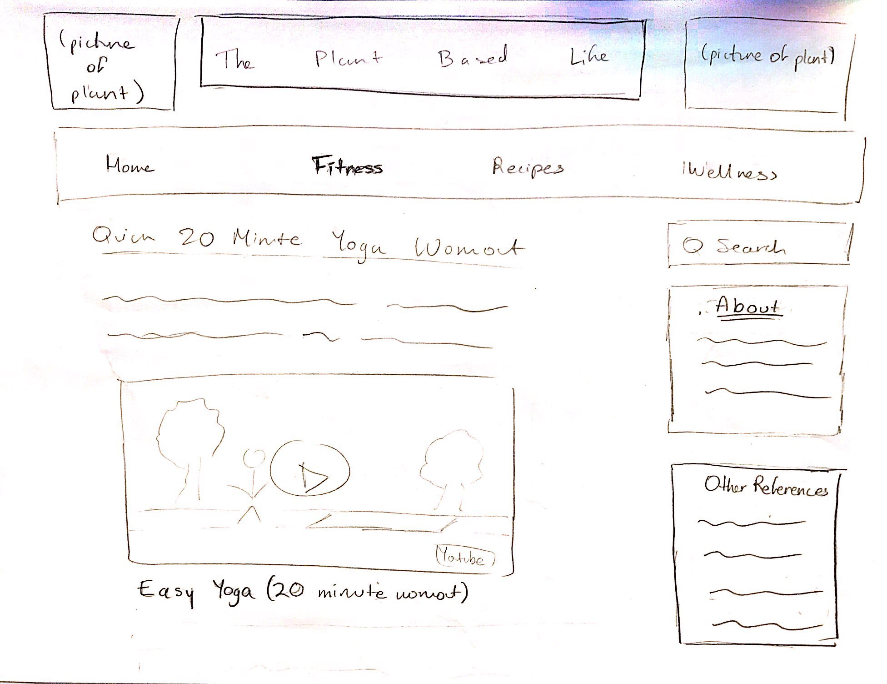
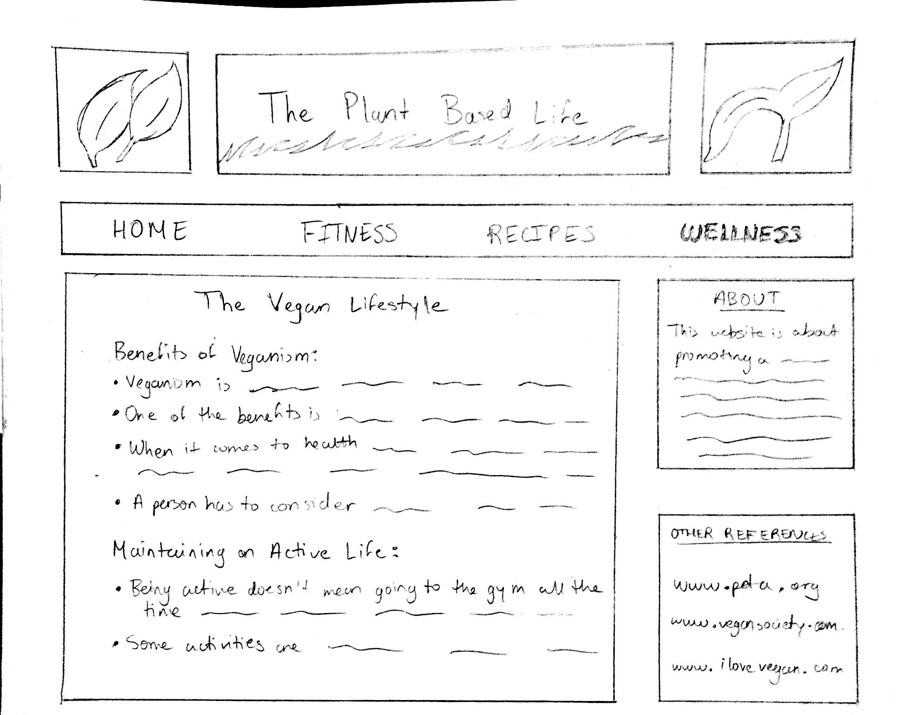

# Project 1, Milestone 1 - Design & Plan

Your Name: Fiorella Atoche

## Markdown

**Tip: The above example image could double for both a sketch and a wireframe.**

## 1. Persona

[1. Pick a persona]

I've selected **[Abby]** as my persona.

I've selected my persona because... [Tell us why you picked your persona in 1-3 sentences.]
She is a more "beginner level" user which I feel I can relate to and is a good way for me to begin web designing.

## 2. Sketches

[2. Create some sketches to generate ideas about a website design that would work for your persona.]

[Tell us why your sketches meet the needs of your persona. 1-3 sentences]

The sketches are suitable for the persona because the website is pretty simple and easy to follow. They layout of where everything is located is clear, and also the fitness aspect is appealing to Abby who exercises quiet often.

[Insert your 2-3 sketches here.]

## 3. Wireframes

[3. Author detailed wireframes that will become the design that you program for the final milestone.]

[Insert your 3-4 wireframes here.]

## 4. Coding Plan & Pseudocode

[4. Author a plan for how you will code your PHP website.]

I will create an includes page that contains PHP and the contents that I want to see on every single page, such as the header, on an init and header file. The header will have links to three other pages (Home, Fitness, Recipes, and Wellness). I will create files for each of these page of the website that will be linked to the header for easy and visible access. The logo for the title of the webpage will be in the PHP includes since I want it to show up on every single page visited by the user.

[Make sure you layout how to you plan to use PHP *includes*.]

[Write your pseudocode for your user defined function.]

    function rotate_image($image_array,$loop_number){
      if($loop_number == 0){
        return;
      }
      foreach($parameter as $image){
       #show the image on the screen in designated area and add link to image
      #to appropriate page
      }
      $loop_number = $loop_number - 1 #subtract 1 from $loop_number
      return rotate_image(%image_array, $loop_number) #call the function again so array of images can be displayed on screen over again
    }
